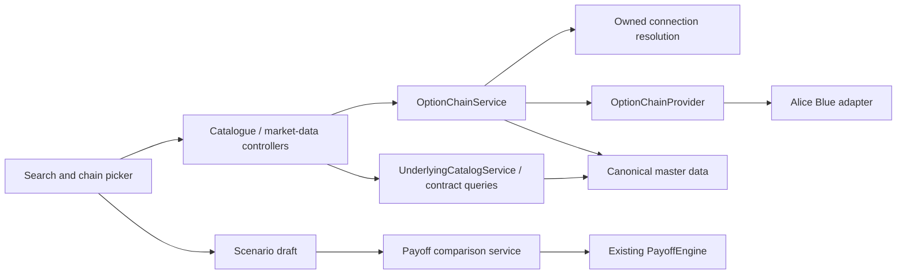

# Strategy builder and position adjustments: implementation plan

Date: 10 September 2026

Status: Proposed implementation; this document does not implement the feature.

Scope: MoneyPlant workspace, `frontend`, and `tradestack`.

## 1. Product outcome

Build a Sensibull-style strategy-building workflow inside MoneyPlant. Users can
search for a stock or index, select an expiry, add several buy/sell option legs
from its option chain, edit their quantities and assumed prices, and immediately
inspect the combined payoff. They can start from an empty strategy or import an
existing account's positions to test a hedge or strategy adjustment.

**Explicit user requirement: no hardcoded stock list.** Search and selection must
cover the available exchange instrument catalogue, including stocks the user
does not hold. ITC is an example, not a special case. A stock with no listed
options remains discoverable and selectable, with an explicit options-availability
state. The initial market is MoneyPlant's existing NSE stock/index universe;
other exchanges are exposed when their catalogue and provider support exist.

The product reference is the interaction: chain-based leg selection, a persistent
leg basket, payoff analysis, and adjustment of imported positions. Sensibull
documents [building and analysing from the option chain](https://blog.sensibull.com/2022/10/06/create-analyse-trades-directly-from-option-chain/)
and [adjusting held positions in its builder](https://blog.sensibull.com/2022/09/02/trade-better-with-sensibull-positions-page/).
Its [leg picker also displays held positions](https://blog.sensibull.com/2023/06/13/strategy-builder-feature-update-see-delta-iv-more-on-leg-picker/).
These references establish the intended workflow, not full feature parity or a
pixel-for-pixel design requirement.

### First release

- Search any stock/index in the catalogue by symbol or available company name.
- Build a custom strategy from scratch, or import the selected live payoff.
- Select actual option expiries and strikes; add multiple CE/PE buy/sell legs.
- Edit draft lots, direction, strike, expiry and assumed entry price; enable,
  disable or remove draft legs independently.
- Compare **Existing positions** and **After adjustments** on the same graph,
  including target-price P&L, breakevens and finite/unlimited profit/loss.
- Preserve imported futures and optional equity holdings, including exact units,
  entry cost and per-leg expiry. New option legs are the initial add-leg scope.
- Model a reduction/close as an opposite hypothetical trade at an assumed price.
- Refresh chain quotes without silently changing accepted scenario entry prices.
- Keep drafts while switching between the live and builder tabs during the page
  session. Clearly label all proposed changes as hypothetical.

Order execution, broker position mutation, saved strategies in the database,
historical tracking, T+0/target-date valuation, IV controls, Greeks, probability
of profit and automatic hedge recommendations are later features. Sensibull's
[target-day payoff table](https://blog.sensibull.com/2023/07/06/payoff-table-on-strategy-builder-analyse-widgets/)
requires valuation capabilities beyond MoneyPlant's current expiry engine.
The initial builder can include an expiry payoff table using the same graph data.

## 2. Verified starting point

Inspected local revisions: workspace `c2ae648`, frontend `cf379f3`, backend
`22270ba`. These are local code references, not a claim about production deployment.
Source paths below are relative to the workspace; backend Java paths share
`tradestack/src/main/java/com/MoneyPlant/tradestack/`.

| Area | Current code | Required change |
|---|---|---|
| Entry point | `frontend/src/pages/PayoffPage.tsx` has Live Positions / Strategy Builder tabs and Open in Strategy Builder | Preserve full account/import context and draft state; add a clear Adjust strategy action |
| Editor | `frontend/src/features/strategy-builder/StrategyBuilderView.tsx` supports several editable legs and recipes | Replace placeholder pricing and underlying chips with search plus a chain picker |
| Stock selection | `analytics/PayoffService.getStrategyMetadata()` lists ten underlyings; ITC is absent | Build catalogue-backed search, with no default-to-first-stock fallback |
| Contract metadata | Same method hardcodes lot sizes/strike steps and generates four Thursdays for every underlying | Read actual per-contract facts and per-underlying expiry availability |
| Premiums | `estimateOptionPrice()` invents recipe prices; Add Leg seeds `100.0` | Select a quoted contract, or require a visibly manual assumption when no quote is usable |
| Live import | `PayoffService.LegView` / frontend `PayoffLeg` omit per-leg expiry, lot size and structural identity; builder assigns one selected expiry to all imported legs | Extend the import contract before relying on imported scenarios |
| Simulation | `POST /api/payoff/simulate` already calls `PayoffEngine` and the heuristic margin engine | Reuse computation; add comparison and explicit price/source semantics |
| Spot | `simulateStrategy()` calls the spot service and can fall back to hardcoded values, including 24500 for unknown stocks | Remove fictional fallback spots from the new builder path; separate spot availability from graph range fallback |
| Chain | `broker/aliceblue/AliceBlueOptionChain` and its debug controller are a probe only | Promote into a typed market-data provider/service; do not wire the UI to the debug endpoint |
| Instruments | `instrument/InstrumentService` has per-broker symbol/key lookups and daily load protection | Add filtered catalogue/contract queries; do not expose its private maps |
| Broad stock catalogue | `broker/paytm/PaytmSecurityMaster` already reads NSE/EQ rows but retains only canonical code-to-ID mappings for cash stocks | Retain display symbol/name and expose canonical catalogue records through an interface |
| Chart | `features/payoff/PayoffChart.tsx` redraws from legs; `chartRange.ts` supports Auto/presets/custom limits | Add two series on one shared price grid and retain existing range behavior |
| Tests | Frontend now has `npm test` using Node tests; backend has JUnit/ArchUnit | Extend current coverage; the older context statement that there is no frontend test runner is stale |

The chain payload was verified in this project on 18 August 2026. Treat that as
historical evidence, not a verification of today's provider availability, rates,
lot sizes or supported stock count. See
[the recorded payload contract](tradestack/docs/aliceblue-api.md) and
[the probe findings](memory/aliceblue-option-chain-verified.md).

## 3. User flows and layout

### New strategy

1. Open Strategy Builder. Show an empty draft with Search stock or index focused;
   recent selections can be shortcuts, but must not determine the supported list.
2. Search by ticker or company name. Results show symbol, name, exchange and
   options availability. Keyboard selection and search loading/error/empty states
   are required. Selecting a cash-only stock shows No listed options; provider
   unavailability must instead say Option data unavailable.
3. Select a stock/index and a valid expiry. Fetch that expiry's chain. Start near
   ATM only when an actual spot is known; otherwise show a clearly labelled
   strike-based initial view. Show both CE and PE prices around a central strike.
4. Buy/Sell on a chain row adds a draft leg with one actual contract lot and the
   displayed quote copied as its assumed entry price. Keep the picker open so
   several legs can be added quickly; show a selected-leg count and quantity badge.
5. Edit the basket and inspect the graph beside it. Templates are optional
   shortcuts that populate the same basket with real contracts and quotes.

### Adjust existing positions, including ITC

1. Select the account's ITC payoff and any existing Include holdings choice.
   Choose Adjust strategy (the existing Open in Strategy Builder bridge).
2. Capture the displayed, successful payoff response as the baseline, including
   connection, exact legs, holding selection, spot metadata and import time.
   Do not re-fetch a different position set while building the import.
3. Show imported legs as Existing and make their contract, units and entry cost
   immutable. Before any additions, the builder's baseline must match that payoff.
4. Choose Add option. ITC is preselected; load its real expiry list and chosen
   expiry's chain on demand. A top-level expiry selector changes the picker, not
   all existing legs. A per-draft-leg expiry edit changes only that leg.
5. Add one or more protective/adjustment legs. The graph overlays the unchanged
   baseline with baseline plus enabled draft trades. A row may show the held
   quantity for the corresponding contract, scoped to the selected account.
6. Reset adjustments clears draft trades and returns exactly to the baseline.
   Update from live explicitly replaces the baseline after showing changed legs;
   retain draft trades and require review of close quantities that no longer fit.

An existing-position scenario has one account and one underlying. Selecting a
different stock starts or switches to a separate draft and preserves the current
one. Do not add a RELIANCE leg to an ITC one-dimensional payoff axis or silently
retarget imported ITC shares/options. Cross-underlying portfolios need a separate
multi-price scenario model. Multiple accounts likewise remain separate.

### Suggested desktop arrangement

```text
Strategy Builder     [New strategy] [Import positions]        Hypothetical
[Search stock/index] [Account/context] [Expiry for picker] [Quote source]
+-----------------------------------+-----------------------------------+
| Option chain                      | Payoff comparison                 |
| CE: Buy Sell LTP | Strike | PE ... | Existing  - -   After adjustments |
| ATM and held/draft quantity marks  | Target price / P&L / change       |
| Expand strikes / Refresh quotes   | Auto / +/-5% / +/-10% / Custom    |
+-----------------------------------+-----------------------------------+
| Existing positions: contract, side, exact units, entry cost            |
| Draft trades: enabled, buy/sell, expiry, strike, lots, assumed price   |
| [Add option] [Reset adjustments]       New premium paid/received      |
+-----------------------------------------------------------------------+
```

On narrow screens use Chain / Legs / Payoff panels with a persistent draft-leg
count and summary. Keep buy/sell labels, focus handling, validation messages and
series line styles usable without relying on color alone. UI language describes
contracts, prices and hypothetical adjustments; backend implementation details
do not belong in the trading flow.

## 4. Catalogue and market-data design

### Stock search is a catalogue feature

Introduce `instrument/UnderlyingCatalogService` and a canonical catalogue-provider
interface in `instrument/`. A Paytm adapter can reuse its existing downloaded
security master and retain NSE/EQ symbol/name metadata. F&O master records and
provider-supported underlyings add option availability and index entries.
Keep vendor parsing in the adapter; controllers do not depend on Paytm internals.

Search must not depend on the user already holding the stock, a successful payoff
request having warmed the master, or a manually maintained ticker list. The
public master path in the current implementation does not require a Paytm login;
keep catalogue discovery separate from authenticated live quote availability.
This reuse needs fixture verification of its display-name columns and coverage.

Deduplicate by canonical underlying within exchange, preserve display spelling
and searchable aliases, and return `hasOptions: true | false | null`. Null means
availability is unknown because the supporting catalogue failed or is incomplete;
it must not become No listed options. Do not derive canonical identity from a
company name or construct broker trading symbols in the browser.

Use a cached daily catalogue with a version/as-of date, stable pagination, bounded
query lengths and capped page sizes. Rank exact symbol, symbol prefix, then name
matches. Refresh the data without a code release when a stock or expiry is added.
Show coverage/freshness when serving a previous successful catalogue after failure.
All backend calls that need broker sessions use the current user's own connections.

### Option-chain service boundary



Add `marketdata/OptionChainProvider`, `OptionChainService`, DTOs and controller.
The provider exposes canonical-underlying discovery, expiries and chain retrieval;
the adapter translates to vendor parameters and returns normalized data. Discover
providers through injected implementations, as with `SpotPriceProvider`.
After fixture coverage and a controlled live check pass, retire the old probe and
debug controller. Do not add option-chain methods to `BrokerGateway`.

The first implementation uses the verified Alice Blue feed. Preserve its actual
envelope (`result[0].data`), explicit `underlying_expiry` array and `spotLTP`.
`interval` requests strikes around ATM; it is not a strike increment. Read
HTTP status before parsing, also detect `status: Not ok` at HTTP 200, and parse
vendor dates with an explicit locale and IST-aware clock. Return ISO dates.

Contract facts come from the selected contract master entry, not one lot size
for an entire stock. Verify the chain's wrapper lot size against the contract
and selected expiry. On disagreement, expose a metadata-conflict state and block
automatic sizing until refreshed/resolved. Keep genuine imported quantities;
never round an existing position to a newly applicable lot size.

Steppers move through actual available strikes. Search/manual strike entry can
select a listed far-OTM contract outside the currently quoted window; request a
larger supported chain window, then show Quote unavailable if the provider still
does not return it. A manual assumption for a known contract is allowed. Do not
invent a chain row, quote, expiry, strike step or fallback NIFTY spot.

### Source selection and freshness

Keep `positionConnectionId` and `marketDataConnectionId` distinct. A position's
account determines the simulated exposure group; quote provenance determines
where the observed price came from. Prefer a capable connection for the position
account; otherwise offer the current user's capable quote connections and show
the selected source. Do not fetch through another user's session.

The project already records an unresolved question about using Alice Blue data
for another broker's positions. This document does not resolve vendor terms.
Build the source abstraction now; enable cross-broker quoting only after that
existing product dependency is resolved. Imported payoff and manual assumptions
must remain usable when live chain access is unavailable.

Use on-demand HTTP fetching initially:

| Event | Data behavior |
|---|---|
| Search text changes | Debounce about 250 ms; query the cached catalogue; ignore superseded responses |
| Underlying selected | Resolve supported sources and actual expiries; no chain for every search result |
| Picker opened / expiry changed | Fetch the chosen `(source, exchange, underlying, expiry, window)` chain |
| Another leg added from the same chain | Reuse the displayed snapshot; no separate chain call per leg |
| Picker visible | Proposed 15-second refresh, suspended when hidden/backgrounded; confirm against provider limits |
| Lots/side/assumed price/enabled changes | Recalculate scenario; no chain fetch caused by these edits |
| Strike/type/expiry changed | Resolve the new contract; clear the old contract's quote and assumed price; seed from its own quote or request manual entry |
| User chooses Refresh quotes | Fetch observations; preserve accepted entry assumptions |
| User chooses Use latest price on draft leg(s) | Explicitly copy current usable quote(s) into selected draft entry prices |

Start with a configurable 5-second server cache and bounded in-flight request
deduplication. Include user ID, source connection/session generation, exchange,
underlying, expiry and requested window in quote cache keys. Check connection
ownership/session validity before serving a cached quote; invalidate on reconnect
and disconnect. Do not copy the spot service's shared-underlying cache policy.

Return `fetchedAt`, optional vendor `quotedAt`, source and availability. A recent
HTTP fetch does not prove a recent trade: the inspected payload has no verified
trade timestamp. Use Last traded price / Retrieved at, not an unconditional Live
badge. Suggested cache-age warning threshold: 30 seconds, configurable; this is
separate from unknown trade age. Stale cached observations remain labelled.
An unsuccessful refresh must not reset their timestamps or replace prices by zero.

Nullable price and `priceKnown` distinguish missing/malformed data from an
explicit zero. Do not use `ltp > 0` as the sole quote-validity test. Auto-fill only
when provider semantics establish a usable observation; otherwise require a
manual assumption. Bid/ask are optional future fields, not fabricated from LTP.

## 5. Proposed API and state contracts

These are proposed additive endpoints/fields, not current API contracts. Keep Java
DTOs and `frontend/src/types/api.ts` synchronized. Existing `/api/payoff` and
`/simulate` callers must continue working during migration.

| Endpoint | Purpose / principal response fields |
|---|---|
| `GET /api/instruments/underlyings?q=&limit=&cursor=` | Search results `{code, symbol, name, exchange, isIndex, hasOptions}`, pagination, catalogue version/as-of and coverage warnings |
| `GET /api/market-data/option-sources?underlying=&exchange=` | Current user's capable source connections with display labels, availability and applicable source-policy restriction |
| `GET /api/instruments/option-expiries?underlying=&exchange=&sourceConnectionId=` | Sorted real expiry dates, catalogue/source status; combine provider availability and listed contracts, never synthesize weekdays |
| `GET /api/instruments/option-contracts?underlying=&expiry=&exchange=&sourceConnectionId=` | Actual canonical option keys, per-contract lot sizes and optional tick sizes; supports strike lookup outside quoted window |
| `GET /api/market-data/option-chain?underlying=&expiry=&exchange=&sourceConnectionId=&strikeCount=` | Normalized chain snapshot, quotes, source, timestamps, returned coverage, row warnings and spot availability |
| `POST /api/payoff/compare` | Frozen baseline plus draft trades; returns baseline and combined payoff, compatible metrics and input revision |

`option-contracts` also accepts the optional position connection when available,
so the backend can verify a selected contract against that account's master.
For expiry/contract discovery, `sourceConnectionId` is optional when the canonical
catalogue already supplies the listing; a missing live provider must still allow
selection of a known contract with a manual price assumption. The chain endpoint
requires a resolved usable source. Distinguish listed expiries from expiries the
chosen quote provider can currently serve.
Allow only owned connections; do not accept a client-supplied user ID or token.
Pass AbortSignals through `lib/api.ts` for search/chain requests. Normalize source
errors into the current API conventions: broker session expiration is a 409
reconnect condition, upstream failure is 502/retry, and MoneyPlant login expiration
alone uses 401. Add typed validation errors with affected fields/leg IDs. A
partially quoted chain may return 200 with row warnings; a failed whole request
must not masquerade as an empty valid chain.

### Canonical records

```ts
type ContractKey = {
  underlying: string;
  expiry: string | null; // ISO date; null for imported EQ
  strike: number;        // zero convention for imported EQ/FUT
  type: "CE" | "PE" | "FUT" | "EQ";
};

type PriceObservation = {
  value: number | null;
  priceKnown: boolean;
  fetchedAt: string;
  quotedAt: string | null;
  sourceConnectionId: string;
  status: "AVAILABLE" | "STALE" | "UNAVAILABLE";
};

type ScenarioLeg = {
  id: string;
  contract: ContractKey;
  exchange: string;
  lotSize: number | null;
  qty: number;                     // signed UNITS; never lots
  entryPrice: number | null;        // per unit; null prevents submission
  priceBasis: "POSITION_AVERAGE" | "QUOTE_SNAPSHOT" | "MANUAL";
  entryQuote: PriceObservation | null; // retained when copying a quote
  currentMark: PriceObservation | null; // independent margin input
  origin: "EXISTING_POSITION" | "EXISTING_HOLDING" | "DRAFT_TRADE";
  enabled: boolean;                // editable for draft trades only
  closesLegId?: string;            // optional reduction/close convenience
};
```

The domain already has `InstrumentKey`; use it for structural identity. Exchange
is retained in the builder contract/catalogue context because provider coverage
is exchange-specific; extending the core key across exchanges is separate work.
Contract tick sizes are optional metadata and must never be confused with strike
spacing. Preserve imported broker/product row identity separately so repeated
contracts do not collapse during import.

Extend live `LegView` / `PayoffLeg` additively with `legId`, `underlying`, `expiry`,
`lotSize`, `origin`, exchange/context and the available mark/provenance fields.
Produce these while `forUnderlying()` still has the resolved `OptionInstrument`,
position and holding data; expiry cannot be recovered from the response's group
expiry list. Include response retrieval metadata and completeness warnings.
If unresolved positions were skipped, disclose that and prevent an unlabeled
claim that the baseline contains the entire account/underlying.

The baseline import is immutable page-session data, not a database snapshot.
Its state includes account/underlying, imported legs, holdings selection, import
time, completeness and spot observation. `PayoffPage` (or a provider above both
tabs) owns the draft, with a stable draft/import ID. Metadata refetches must not
rerun initialization and overwrite user edits.

The comparison request contains `{revision, context, spot, baselineLegs,
draftTradeLegs}`. `context` carries the scenario underlying, exchange, optional
position connection and baseline import metadata. A new strategy sends an empty
baseline. Include disabled draft rows for editing state if useful, but compute
only enabled nonzero draft trades; baseline rows are always included.

The response contains `{revision, spot, expiries, assumptions, baseline, combined,
adjustmentCashflow, marginStatus, warnings}`. Each payoff result retains the
existing `PayoffResult` shape and global limits. Baseline/combined use one common
spot observation, price basis and model version. Echo the revision so old results
cannot replace a newer edit. Treat the client baseline as a hypothetical input,
not a newly verified broker position statement; server-side connection access
still checks ownership before any optional metadata/quote retrieval.

Extract a shared computation method/service used by `/simulate` and `/compare`;
do not create another payoff engine. `/compare` must not poll positions or the
option chain during each calculation. Resolve observations through the explicit
data flow and calculate from the accepted inputs. Nullable/unknown spot permits
expiry payoff from valid legs; it disables current-spot metrics and any margin
calculation requiring spot. A derived chart anchor is never labelled spot.

## 6. Calculation and interaction invariants

For signed units `q`, entry/assumed price `p` and terminal underlying price `S`:

```text
Call P&L    = q * (max(S - strike, 0) - p)
Put P&L     = q * (max(strike - S, 0) - p)
Future/EQ   = q * (S - p)
Baseline    = sum(existing legs)
Combined    = Baseline + sum(enabled draft trades)
Change at S = Combined(S) - Baseline(S)
New option premium received = -sum(draft option q * assumed entry price)
```

Positive premium is a credit; negative is a debit. Quantities are already units;
the lot multiplier is applied exactly once when converting the user's lot input.
Premium totals include CE/PE only, not the notional entry value of shares/futures.

The default payoff basis remains the current engine's **open positions from their
entry cost plus proposed trades**, excluding already realized historical P&L,
brokerage, taxes and other charges. State this in the UI. Do not imply that it
reconciles to the broker's lifetime total after earlier partial closes. A later
realized-P&L offset feature must apply the same offset to both curves and all
metrics, with a trustworthy source.

Never replace imported average entry cost with chain LTP. Draft entry prices are
fixed at their accepted quote/manual assumption. Refreshing current marks can
change margin inputs and the spot marker; it does not reprice historic entry.

**Closing is a trade, not deletion.** Closing `q` existing units adds `-q` units
of the identical contract at the assumed close price. For example, a short call
entered at 12 and hypothetically bought back at 7 has constant P&L of `5 * abs(q)`.
Deleting the original leg would erase that P&L. Partial-close controls cannot
exceed the selected held quantity; a larger opposite trade must be explicitly
represented as a close plus a new reversed position. Draft enable/delete affects
only proposed trades. Roll convenience is close-old plus open-new, with the
mixed-expiry qualification below.

For chart comparison, sample both leg sets on one union of their strikes,
breakevens, endpoints and regular price points. Calculate each curve from its
legs using `payoffMath.ts`/`chartRange.ts`; do not zip separate arrays by index.
Use one x/y range that includes both series. Tooltip and target inspector show
both P&Ls and their difference. Allow target spot zero. Retain linear segments,
stock/index Auto range settings and global limits independent of viewport zoom.

Both baseline and combined metrics must preserve exact finite/unlimited flags.
Do not subtract infinity to show a numerical improvement: render Unlimited to
bounded (or the reverse), and compare breakeven sets rather than one arbitrary
root. Paise rounding happens after calculation, not at each intermediate step.

When enabled legs have more than one derivative expiry, label the graph **Expiry
scenario** and list the dates. The current engine applies one terminal price to
all contracts; it does not value later-expiry time value at the first expiry.
Repeat the live page's qualification on profit/loss bounds in the builder.
Equity has no expiry and does not make a scenario mixed. See the existing
[payoff range decisions](memory/payoff-ranges-and-limits.md) and
[holdings rules](memory/payoff-holdings.md).

### Margin and cashflow

The requested payoff workflow must work even when margin is unavailable. Existing
simulation reuses `price` as both entry cost and mark; fix that distinction before
displaying imported-scenario margin. Pass current known marks to the heuristic
engine and entry prices to payoff. Net identical contracts within the same
scenario/account for margin, so a fully closed contract has no residual exposure;
retain both trade rows for payoff accounting. Keep expiry grouping intact.

Show heuristic margin as an estimate with its input status. Hide it for active
equity holdings under the current delivery-margin limitation, missing required
marks/spot or unresolved contract facts. Do not label `initialMargin -
withBenefitMargin` as the benefit of these adjustments: that is the existing
engine's standalone-versus-basket comparison. If available, compare baseline
and combined basket estimates explicitly, keeping unrelated account positions
out of the claim.

Show **New premium paid/received** separately. Existing entry premiums were
already paid/received; adding them to new funds required charges them again.
Do not reuse `totalFundsRequired` as cash needed to execute the adjustment or
promise broker margin release. Actual execution capital/basket margin remains
separate work. No snapshot risk-report figures are presented as live inputs.

## 7. Validation and failure behavior

- Validate canonical underlying consistency for every baseline/draft leg, supported
  types, finite nonnegative prices, positive option strikes, valid date formats,
  signed integer units and sensible request/leg-count bounds (initial proposal:
  50 total legs). Reject NaN/infinity and numeric overflow with field errors.
- New option quantities must be whole contract lots. Preserve existing exact units
  even if the current catalogue's lot size changed; show a mismatch warning and
  validate proposed close sizes against the applicable contract rules.
- New contracts must actually be listed and match the source/master identity.
  Existing expired/delisted legs may remain in an imported scenario with an
  explicit status, but cannot seed a falsely current quote or be silently retargeted.
- A quote failure keeps existing positions and valid draft assumptions visible.
  An unpriced enabled draft blocks its new combined result; do not omit it and
  present the remaining basket as complete. Baseline remains available.
- A missing spot hides its marker and current-spot metrics; expiry payoff still
  works using the range fallback. Require a manual spot only for a calculation
  that actually needs one, with the assumption visibly labelled.
- Debounce server simulation around 250 ms and track revisions. Fast quote loads
  or simulations for a previous stock/expiry/draft cannot update the current one.
  Show Updating and visible calculation errors; if keeping the last successful
  graph, label it with the prior revision instead of displaying it as current.
- Switching tabs preserves drafts. Changing account/underlying or replacing a
  nonempty draft with a recipe is explicit and preserves another draft or offers
  a clear replacement confirmation. Background metadata changes never reset legs.
- A market-data session failure surfaces the correct reconnect action without
  logging the user out of MoneyPlant or clearing their draft.

## 8. Work breakdown and file ownership

Implement in dependency order. Each phase should have a reviewable diff and
passing checks; development phases do not require separate deployments. Feature
enablement occurs only after the end-to-end acceptance cases pass.

| Phase | Deliverable / main files | Exit criteria |
|---|---|---|
| A. Correct baseline import | Backend `analytics/PayoffService.java` and response DTOs; frontend `types/api.ts`, `pages/PayoffPage.tsx`, new `features/strategy-builder/scenarioState.ts` | Same-account import preserves expiry, units, cost, origin and holding choice; unchanged baseline matches live response |
| B. Search and contract catalogue | New `instrument/UnderlyingCatalogService`, catalogue provider/DTO/controller; extend `InstrumentService`; Paytm master adapter; frontend search hook/component | Search finds a fixture stock never named in source; cash-only/unknown availability differs; expiries/lot sizes/strikes come from fixtures/master |
| C. Production chain service | New `marketdata/OptionChainProvider`, service/controller/DTOs; Alice Blue provider/parser; remove old probe after verification; frontend `lib/api.ts`, `types/api.ts`, chain hooks | Correct canonical rows, provenance, bounded calls, ownership and error classification; no guessed premium |
| D. Comparison engine contract | New `analytics/PayoffComparisonRequest`, response and service; `PayoffController`; extract shared simulation computation; `payoffMath.ts`, comparison/chart helpers | Exact baseline + draft arithmetic, closing cashflow, complete global bounds and mixed-expiry labels |
| E. Builder experience | Refactor `StrategyBuilderView.tsx`; new `UnderlyingSearch`, `OptionChainPicker`, `StrategyLegEditor`, comparison summary; extend `PayoffChart.tsx`, `chartRange.ts`; `PayoffPage.tsx` | Search, multiple additions, leg edits, price reset, baseline overlay, target inspector, mobile/keyboard flows and stable tab state |
| F. Recipes and margin correctness | `analytics/StrategyTemplate.java`, builder recipe loading, simulation margin mapping/DTOs | One recipe implementation maps offsets to actual available strikes and quote observations; no placeholder prices; margin/cashflow use separate inputs |
| G. Integration and documentation | Tests below; update `CLAUDE.md`, strategy-builder memory and API docs to describe shipped behavior | Acceptance walkthrough and relevant builds pass; remaining provider limitations recorded |

For recipes, use the existing tested Java recipe definitions as the single source.
Refactor them to produce contract selections/offsets without estimated premiums;
resolve those to actual listed strikes and quote snapshots through a template
service (e.g. additive `POST /api/payoff/template`). Remove the duplicated frontend
recipe switch. Applying a recipe in an existing-position draft adds its proposed
legs; it does not replace the baseline. If a required contract/quote is unavailable,
show the incomplete recipe for review rather than inventing it.

Optionally add an Analyse/Adjust action to each account/underlying group in
`frontend/src/features/positions/PositionsTable.tsx` once the builder flow works.
It should pass account/underlying context and load the existing payoff import
path, not construct another lossy leg mapping in the positions table.

No database migration or snapshot backfill is required for the first release.
Keep persistent saved drafts, history/Greeks capture, new brokers and order
execution out of these changes. Future implementation branches must follow
`AGENTS.md`, using one branch name across affected repositories.

## 9. Regression coverage and acceptance

### Backend

- Extend `PayoffServiceTest`, `PayoffHoldingsTest` and serialization/controller
  coverage for per-leg expiry/lot size/origin, holding quantity and account scoping.
- Catalogue tests: arbitrary fixture stock and company-name search, punctuation
  aliases, pagination, cash-only stock, metadata failure versus no options,
  refreshed listing, expiry-specific lot-size changes, and cold-start loading.
- Chain parser fixtures: real nested wrapper, named expiry array, string numbers,
  missing CE/PE, explicit zero, blank/negative/NaN prices, metadata disagreement,
  HTTP-200 soft failure, non-JSON 401 and unavailable far-OTM quotes.
- Chain service tests: current-user ownership, multiple accounts, cache separation,
  session invalidation, deduplicated identical requests, expiry/window keys,
  stale-on-failure timestamps and a controlled `Clock`.
- Comparison tests: long/short CE/PE, imported FUT/EQ, no additions, disabled
  drafts, debit/credit, opposing same-contract trades, partial/full close, mixed
  expiries, invalid legs, unknown spot and global roots/unlimited tails.
- Margin tests, when enabled: entry price differs from current mark, closed
  contracts net to zero exposure, missing marks suppress estimates, holdings
  suppress unsupported margin, and new premium excludes original entry cashflow.
- Keep ArchUnit boundaries and the existing margin calibration suite green.
  Use fixed clocks for margin/expiry-dependent assertions.

### Frontend

Use the current `npm test` pattern for pure state, normalization, comparison and
range helpers. Cover immutable imports, no reinitialization on metadata refresh,
tab persistence, strike/expiry quote invalidation, snapshot/manual price handling,
units versus lots, disabled draft validation, target spot zero, union-grid
comparison, stale-revision rejection and error state transitions.

Verify rendered flows on desktop and narrow screens using deterministic API
fixtures or a controlled local session. Browser checks must include search result
selection by keyboard, adding several legs without dismissing the chain, exact
baseline overlay, manual price edit/reset, two expiries, failed reconnect,
out-of-order responses and going back to Live then returning to the draft.

### Concrete ITC acceptance fixture

These are invented test prices/strikes, not market quotes or recommended trades.
Let `L` be the lot size supplied by the fixture/master, never a literal in product
code. Existing position: short `L` ITC calls at strike 450, entry price 12. Add
`L` calls at strike 460, assumed price 4, with the same fixture expiry.

| Terminal ITC price | Existing P&L | After hedge P&L |
|---|---:|---:|
| 440 | `12L` | `8L` |
| 455 | `7L` | `3L` |
| 480 | `-18L` | `-2L` |

Assert combined maximum profit `8L`, maximum loss `-2L`, breakeven 458, new
premium debit `4L`, and transition from unlimited to bounded loss. Disable the
draft leg and recover the original curve exactly. Separately buy back the
original 450 call at 7 and assert a flat `5L` payoff with zero residual contract
quantity for margin. Repeat catalogue selection with a different fixture stock
absent from all production literals to prove ITC has no special branch.

### Release acceptance checklist

- [ ] A user can search any catalogue stock/index, including unheld stocks.
- [ ] Unsupported/no-options/unknown-data states are distinct and actionable.
- [ ] New strategy and imported-position strategy use the same builder workflow.
- [ ] Real contract expiries, strikes and per-leg lot sizes replace hardcoded data.
- [ ] Multiple additions and per-leg edits update the combined payoff correctly.
- [ ] Original positions/cost basis remain stable; close/roll preserve cashflow.
- [ ] Baseline and combined graph share a grid, units, assumptions and global limits.
- [ ] Missing/stale quotes and mixed expiries cannot imply unjustified precision.
- [ ] Quote refresh does not overwrite manual or accepted draft entry prices.
- [ ] Account, user and exchange/source boundaries are covered by tests.
- [ ] Desktop/mobile/keyboard walkthroughs and required build/test gates pass.
- [ ] No order placement, broker mutation or snapshot dependency was introduced.

## 10. Verification of this planning change

Only this implementation document and its project-memory reference are intended
file changes. Application code has not been modified. The task branch is
`docs/strategy-builder-hedging-plan` in all three repositories; existing untracked
backend files remain unrelated and preserved.

Completed baseline checks:

- `frontend`: `npm test` passed, 16 tests, zero failures.
- `frontend`: `npm run build` passed (TypeScript and Vite). Vite retains its
  warning about the existing JavaScript chunk exceeding 500 kB.
- `tradestack`: `.\mvnw.cmd clean package` passed, including the default test suite
  and executable JAR packaging. The configured `db`-tagged tests are excluded;
  no Docker/database integration or live broker check was performed.
- Document checks: all four local source links resolve, Markdown fences balance,
  and the illustrative hedge/close arithmetic passes at all three listed prices.
- `git diff --check` passed for the tracked changes; repository status confirms
  no application-source changes and preservation of existing backend files.

These checks validate the inspected starting code and document, not the proposed
feature. Future implementation must run the new regression cases and browser
scenarios above. Nothing was committed, pushed, deployed or published.
