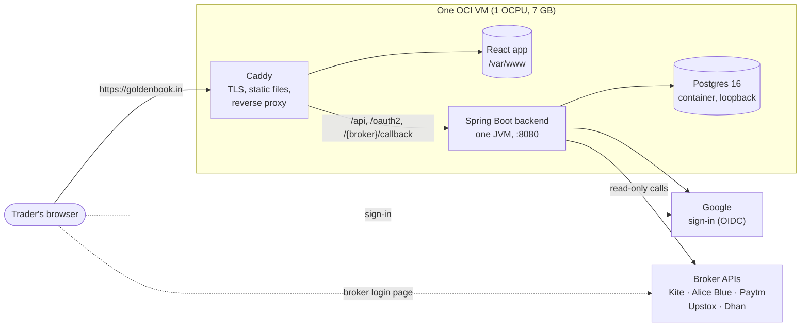

# Architecture overview

## The system in one picture

- **Single origin.** The web app and the API answer on the same host, so there is no CORS and the session cookie
  belongs to one origin.
- **One JVM instance, by decision** ([ADR 0017](https://github.com/bnmnikhil/MoneyPlant/blob/main/docs/adr/0017-single-jvm-instance.md)).
  Broker sessions are held in memory and the end-of-day capture is scheduled per instance, so a second
  instance would split sessions and duplicate captures. The ADR records what scaling out would cost.
- **Postgres on the same VM**, in a container bound to loopback. The security list does not protect a Docker
  published port, so it is bound to `127.0.0.1` explicitly.
- **The browser talks to brokers directly only for the login page.** Everything else goes through the backend,
  which holds the tokens.

## The backend, by package

Package-by-module under `com.goldenbook.tradestack`. The boundaries are enforced by tests (ArchUnit,
[ADR 0011](https://github.com/bnmnikhil/MoneyPlant/blob/main/docs/adr/0011-enforce-boundaries-with-archunit.md)), not by convention.

| Package | Responsibility |
|---|---|
| `broker/` | Routing and discovery only: `BrokerService`, the registries, the fan-out |
| `broker/spi/` | What a new broker implements: `BrokerGateway`, `BrokerAuthProvider`, `RawPortfolioSource`, capabilities |
| `broker/catalog/` | Backend-owned broker names, setup fields and **rollout state**, served as `GET /api/brokers` |
| `broker/session/` | Sessions, the encrypted session store, the connect nonce (`PendingConnect`), the status endpoint |
| `broker/kite`, `aliceblue`, `paytm`, `upstox`, `dhan` | One private package per broker: gateway, session service, callback, mapper, HTTP |
| `portfolio/` | Thin controllers and the neutral DTOs (`PositionDto`, `HoldingDto`, `MarginDto`) |
| `instrument/` | The contract master and the application's own symbol vocabulary |
| `analytics/` | Payoff engine and service, the strategy builder, strategy templates |
| `marketdata/` | Spot prices and the option chain, with their per-user caches |
| `pricing/` | Option pricing (Black-Scholes) |
| `risk/` | Exposure, expiry buckets, and the heuristic margin engine. **Reads snapshots, never brokers** |
| `snapshot/` | Capture of every broker fetch, the end-of-day job, typed snapshot tables |
| `credential/` | Per-user, per-broker credentials, encrypted |
| `auth/` | Google sign-in, admission modes, the application session |
| `common/` | Error handling, environment, shared helpers |

Four rules that explain most of the shape:

1. **Gateways are stateless.** The user's session and credentials are *parameters*, never fields, so one bean
   serves every user and every account.
2. **Vendor types stop at the adapter.** Each broker's package is private, and nothing outside it may depend on it.
   The neutral DTOs are the only thing that crosses.
3. **The application owns its symbols.** Broker symbols exist only inside that broker's adapter, at the moment of
   a call. The domain speaks `NIFTY`, `M&M` becomes `MM`, and a registry translates both ways.
4. **A broker is exactly as visible as its rollout state allows.** Every place that offers a broker consults one
   policy.

## The frontend

React 18, TypeScript, Vite, Tailwind and shadcn/ui, built as a static single-page app
([ADR 0023](https://github.com/bnmnikhil/MoneyPlantFrontend/blob/main/docs/adr/0023-static-spa-no-ssr.md): no server rendering).

- **One fetch layer** (`lib/api.ts`) maps a `401` to the login page and a broker error to a reconnect banner.
- **TanStack Query** owns server state; positions and payoff refetch every 30 seconds, holdings every minute.
- **Features are isolated** under `features/`, with the backend's TypeScript contract mirrored in `types/api.ts`.
- Routes: `/` landing, `/login`, then the signed-in shell at `/app` (Overview, Positions, Holdings, Payoff,
  Risk, Settings).

## Data

Ten Flyway migrations (V1 to V10) create: encrypted `broker_credential` (with an optional `client_id`),
`broker_session`, `raw_capture` (every broker payload kept as received), the typed snapshot tables
(`position_snapshot`, `holding_snapshot`, `margin_snapshot`, `spot_snapshot`) and `app_user`.

**Every broker response is archived** as it arrives (`raw_capture`) and again, mapped, into the typed tables
([ADR 0013](https://github.com/bnmnikhil/MoneyPlant/blob/main/docs/adr/0013-snapshot-store-typed-columns-plus-raw-jsonb.md),
[0014](https://github.com/bnmnikhil/MoneyPlant/blob/main/docs/adr/0014-capture-on-fetch-and-at-eod-record-gaps.md)).
This is why a mapping mistake found later is correctable: the original is still there.

## Decisions on record

The architecture decision records, in the repositories that own them:

| | |
|---|---|
| Backend | [`docs/adr/`](https://github.com/bnmnikhil/MoneyPlant/tree/main/docs/adr): boundaries, snapshots, fan-out scoping, single JVM, package layout, session storage, risk model, broker SPI, capabilities |
| Frontend | [`docs/adr/`](https://github.com/bnmnikhil/MoneyPlantFrontend/tree/main/docs/adr): generated types, static SPA, feature isolation |
| Project memory | [`memory/`](https://github.com/bnmnikhil/MoneyPlantContext/tree/main/memory): the reasoning behind decisions, one file each |
