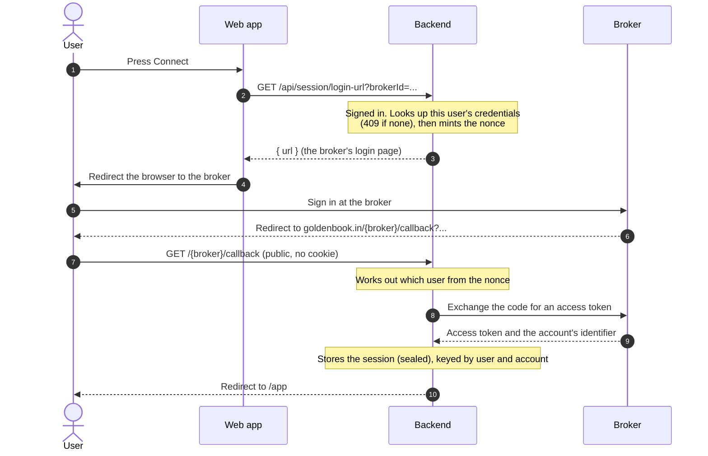
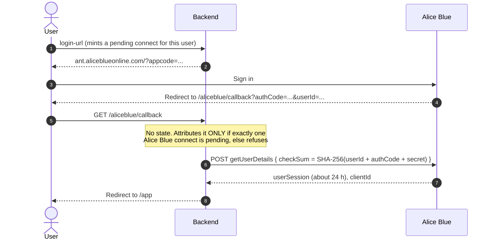
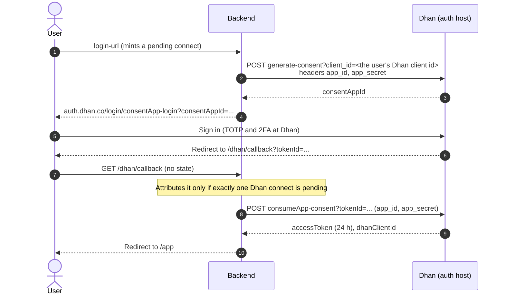

# Connect flows

How a user links a broker account. Every broker follows one frame, and differs in three places: how the login
URL is built, how the browser comes back, and how the app works out *which user* came back.

## Why the callback needs a nonce

The broker redirects the user's browser to GoldenBook's callback. That request is **public** and **carries no
session cookie**, because the cookie does not survive the cross-site redirect (measured). Something other than
the cookie must say whose connection it is. That something is a **single-use nonce** minted while the user is
still signed in, held in memory for **ten minutes**, and redeemed once by the callback.

Two brokers cannot carry a nonce through their login. For those the callback is accepted only when **exactly one
connect for that broker is pending**, and refused when there are two, never guessed.

## The common frame

Credentials are looked up **fresh at the callback**. A secret never rides in a URL the browser and the broker can
both see.

## Brokers that carry the nonce back: Kite, Paytm, Upstox

| | Kite | Paytm | Upstox |
|---|---|---|---|
| Login URL | `kite.zerodha.com/connect/login?v=3&api_key=...&redirect_params=state%3DNONCE` | `login.paytmmoney.com/merchant-login?apiKey=...&state=NONCE` | `.../v2/login/authorization/dialog?client_id=&redirect_uri=&response_type=code&state=NONCE` |
| Callback carries | `request_token`, `state` | `requestToken`, `state` | `code`, `state` |
| Exchange | `POST /session/token` with a SHA-256 checksum of key, token and secret (the secret is never sent) | `POST /accounts/v2/gettoken` with key, secret, token | `POST /v2/login/authorization/token`, a form with the five OAuth fields |
| Account label | `user_id` from the same response | A second call, `user/details` | `user_id` from the same response |
| Token | About a day | About a day | Until 03:30 IST next day |

The callback reads `state`, redeems the nonce, and knows the user.

## Alice Blue: no nonce, one pending connect

Alice Blue's login page takes an app code and forwards nothing else, so the nonce cannot ride through.

**Consequence for users:** press Connect **once** and finish. A second click before the first completes (or
expires) leaves two pending and the callback is refused, with "the connect attempt timed out". This is why
`login-url` resolves credentials *before* minting the pending connect: a refused attempt must not strand one.

## Dhan: a server step first, and no nonce

Dhan's flow has three steps and the first is on the server. Its login URL cannot be built from the credentials
alone.

Three details:

- **The user's own Dhan client id** is a third credential, stored beside the key (an optional `client_id` on a
  registration). Building the login URL needs it.
- **If step 1 fails**, the pending connect that was already minted is cancelled. A stranded one would break the
  user's next attempt under the one-pending rule.
- **The browser is sent to a different address from the one the server calls.** On staging the server reaches the
  simulator on loopback while the browser needs the public host, so the login page has its own setting
  (`GB_DHAN_LOGIN_URL`). A single shared setting once sent a browser to `127.0.0.1`.

## When a connect fails

The callback redirects to `/app?error=...` and the web app shows a message:

| Code | Meaning |
|---|---|
| `connect_expired` | No pending connect could be attributed: it timed out, was already used, or (Alice Blue, Dhan) there were two |
| `<broker>_not_configured` | The credentials were deleted between pressing Connect and the broker answering |
| `<broker>` | The broker refused the exchange, or the user declined |

Broker errors are logged by type, never with the credentials that produced them.

## Staying connected

A session lasts as long as the broker allows and is stored in Postgres, sealed. After a restart the backend
restores only sessions created **today in IST**. A dead token shows as a "reconnect" warning on that broker
alone; the others keep working.
