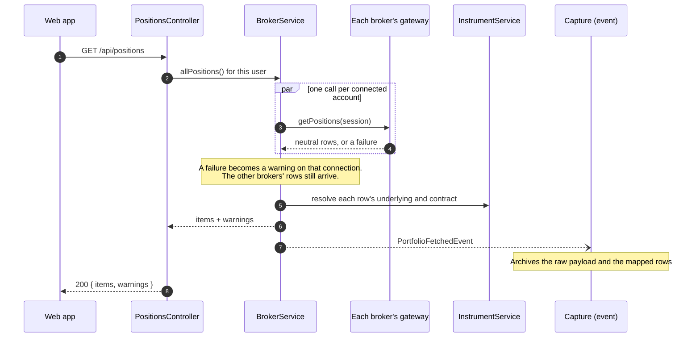
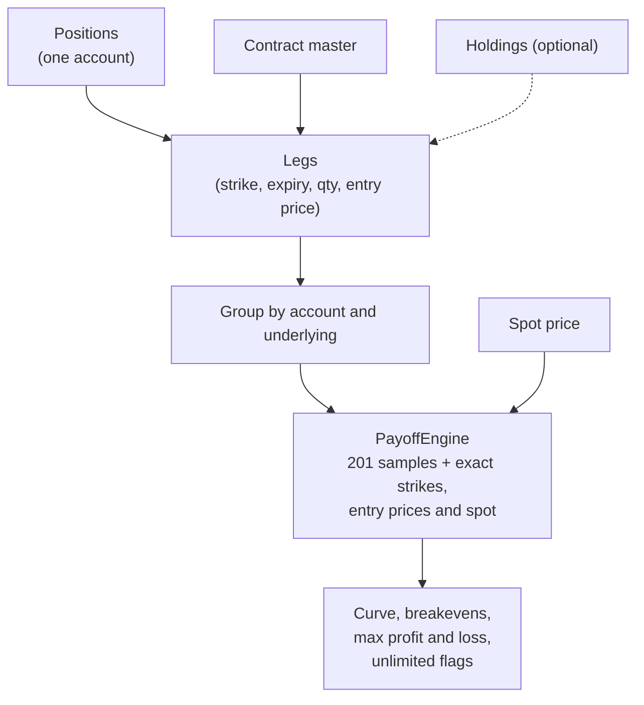
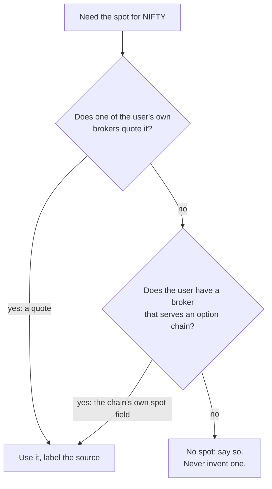
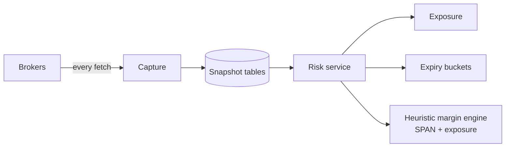

# Reading and analysis

What happens when a page loads, and how payoff, spot and risk are produced.

## Loading positions: the fan-out

- **Partial success is the normal case and returns 200.** If Kite answers and Alice Blue's token is dead, the page
  gets Kite's rows plus a warning. A non-200 means the whole request failed.
- **Warnings have two kinds.** `SESSION_EXPIRED` means reconnect; `CALL_FAILED` is transient and must not tell the
  user to reconnect (a rate limit or a timeout is not an expired login).
- **Capture is decoupled.** The broker service publishes an event and knows nothing about the database, so no
  gateway call has a database side effect. A scheduled job also captures at 15:35 IST, and gaps are recorded, not
  hidden.
- **Instrument resolution** adds the underlying, strike, expiry and lot size from the contract master. Without it
  a four-leg condor would show as four groups of one, and no payoff could be drawn.

## Payoff

The engine is a pure function: legs and a spot in, a curve out. Breakevens are found by linear interpolation
inside the plotted range and de-duplicated. Whether profit or loss is unlimited comes from the exact net call,
future or equity quantity at the upper tail. The curve always includes spot zero for the finite extremes.

### Where spot comes from

The cache is **per user and per underlying**, with the source shown ("Current spot · Paytm"). An earlier shared
cache let one user's broker supply another user's price, which is why it is per user. A shared market-data
account for users without a quoting broker is designed but not built.

## The strategy builder

The builder posts a set of legs to `POST /api/payoff/simulate` or `/compare`. Existing positions import as an
**immutable baseline** per account and underlying; closes and additions are hypothetical draft trades on top.
Option prices come from the **option chain**, selected independently of the account that holds the positions (so
a Kite position can be priced from Alice Blue's chain). The chain is fetched through whichever of the user's
connections can serve it; Alice Blue is the only chain source today.

## Risk

**The risk module reads stored snapshots, never brokers**
([ADR 0012](https://github.com/bnmnikhil/MoneyPlant/blob/main/docs/adr/0012-risk-reads-snapshots-never-brokers.md)).
That keeps a risk request from depending on a live session or on market hours. The cost is that the figures are
only as fresh as the last capture, and the page says which. **Known problem:** the snapshot tables were seeded
once and are not refreshed from the archive, so the risk page can compute on positions days old (launch item A1).
The numbers are labelled `STALE`, but they are wrong until A1 is fixed.

## Where to read the code

| Topic | Start at |
|---|---|
| The fan-out | `broker/BrokerService.java` |
| A broker adapter | `broker/aliceblue/` (the most commented), or `broker/upstox/` (the newest) |
| Payoff | `analytics/PayoffEngine.java`, `PayoffService.java` |
| Spot | `marketdata/SpotPriceService.java` |
| Margin | `risk/HeuristicMarginEngine.java` |
| Capture | `snapshot/CaptureService.java` |
