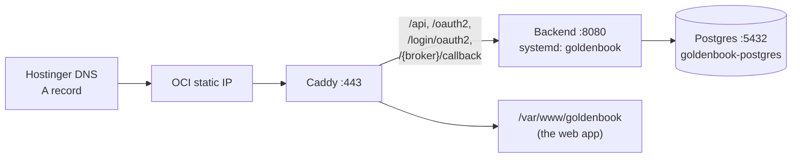

# Environments and deploy

Three environments, one codebase. Which one a process is in is decided by `GB_ENVIRONMENT`, and the backend
refuses to boot if the broker URLs contradict it.

| | **Production** | **Staging** | **Local** |
|---|---|---|---|
| Address | `goldenbook.in` | `staging.goldenbook.in` (basic auth) | `localhost` |
| Brokers | The real ones | The **simulator** (`broker-sim`) | Real or simulated |
| Sign-in | Google, open sign-up | Google, allowlist of testers | Dev auth, no Google |
| Backend | `:8080`, user `goldenbook` | `:8180`, user `gbstaging` | `:8080` |
| Postgres | Container, `:5432`, loopback | Own container, `:5442`, loopback | Native, `:5433` |
| Deploys | **`main` only** | **Any branch** | n/a |
| Data | Real users | Simulated, never production data | Dev data |

Production and staging share **one VM** (1 OCPU, 7 GB). Staging is capped (512 MB heap for the backend, 256 MB for
the simulator) so it cannot starve production. A staging build on the single core can briefly slow production, so
build outside market hours and stop staging first when building production.

## Production

- **Configuration** is in `/etc/goldenbook/goldenbook.env` (root-owned, mode 600), never in git. It holds the
  database password, `GB_CREDENTIAL_KEY`, the Google client, `GB_SIGNUP_MODE` and the broker rollout flags.
- **Caddy** obtains and renews the TLS certificate. The DNS record must stay DNS-only (no proxy), or the
  certificate challenge never reaches the box.
- **Logs** go to journald, kept 28 days. Caddy's log drops query strings and `Referer`.
- **Old host.** `moneyplant.bonamnikhilbabu.in` redirects (308) to the new host so broker apps registered with the
  old callback keep working.

## Deploying production

1. Merge to `main` and run the gates (backend `mvnw clean test`, frontend `npm test` and `tsc -b`).
2. **Outside market hours** (09:15 to 15:30 IST): the backend is down for the jar swap.
3. Take a **pre-release copy** on the VM by hand: a database dump, the current jar, the site and the env file.
   Backups are not automated yet, so copy the dump **off the VM** too.
4. Run `deploy-from-local.ps1` (production, `main`). It runs `deploy.sh` on the VM, which fetches `main` in both
   repositories, builds the backend **and runs its full test suite on the VM**, builds the frontend, then swaps
   the jar and the site and restarts the service. A failing build aborts before anything is swapped.
5. Verify: the boot line shows the broker rollout states and only vendor hosts; Flyway reports the new version;
   no errors since boot; pages load without a reconnect.

`deploy.sh` **refuses any branch but `main`.** Anything else goes to staging first.

**Rolling back** restores the jar and the site from the pre-release copy. A Flyway migration is not reversed;
migrations are written to be additive, so older code keeps working with a newer schema.

## Staging

`staging.goldenbook.in` runs the same app against `broker-sim`, behind basic auth, so any branch can be deployed,
signed into, connected to simulated brokers and broken on purpose at any hour.

- **Deploy any branch:** `deploy-from-local.ps1 -Target staging -Branch <name>` (the same branch name in both
  repositories; the simulator branch is separate and defaults to `main`).
- **The simulator** serves Kite, Alice Blue, Paytm, Upstox and Dhan under `/kite`, `/aliceblue` and so on.
  Only the fake **login pages** are published to the browser, under `/sim/...`; its data API is reachable by the
  backend on loopback only.
- **Credentials in the simulator** must start `sim_`; anything else is refused with that broker's own error, so a
  real key typed into staging fails visibly and goes nowhere. The secret is the key with `sim_` replaced by
  `sim_secret_`.
- A visible **STAGING banner** and an amber favicon mark every page.

## Broker rollout flags

Each broker is `hidden`, `internal`, `staging` or `available` per environment. To switch one on or off in an
environment, set or remove `GB_ROLLOUT_<BROKER>` in that environment's env file and restart. Stored sessions
survive and reappear. The boot line states every broker's state.

## Local development

`GB_ENVIRONMENT=local`, `GB_DEV_AUTH=true` (signs every request in as a fixed user and refuses to start unless the
frontend URL is loopback), Postgres natively on port 5433, the backend on `:8080`, Vite on `:5173`. The simulator
can run on the laptop too. `scripts/verify.ps1` is the single verification entry point (see `TESTING.md`).

## Not automated yet

No backups, no monitoring or alerting, no CI, no tested rollback path beyond the manual copy, and no incident
runbook. All are in the gaps review in
[`NEXT-STEPS.md`](https://github.com/bnmnikhil/MoneyPlantContext/blob/main/NEXT-STEPS.md) and the observability plan.
The authoritative runbook is
[`deploy/README.md`](https://github.com/bnmnikhil/MoneyPlant/blob/main/deploy/README.md).
